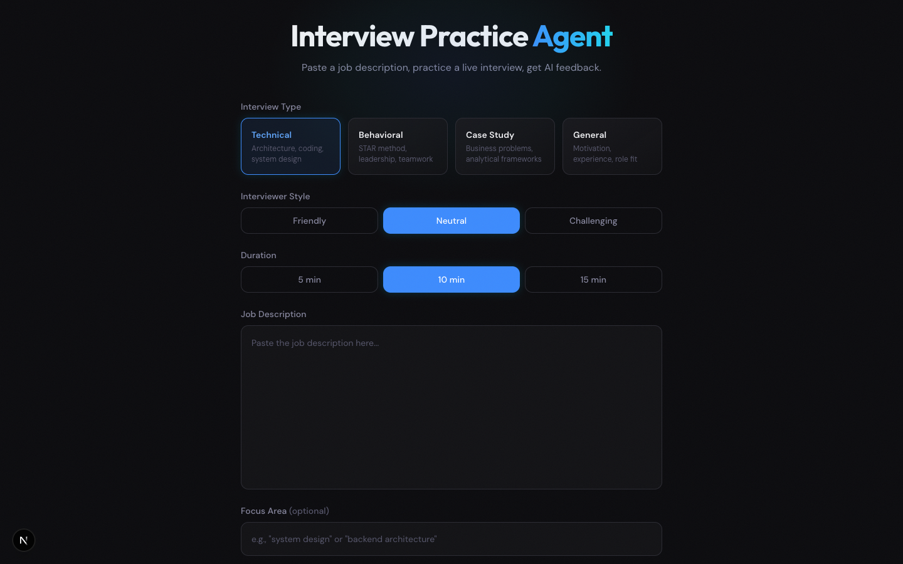
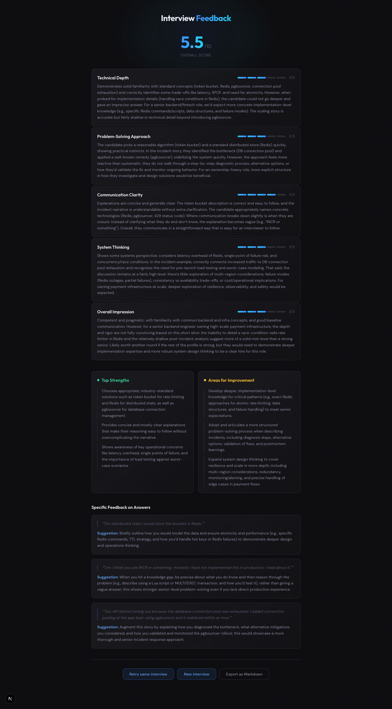

# Realtime Interview Practice

A voice-based technical interview practice app. Talk to an AI interviewer in real time, then get structured written feedback on your performance.

Built on the [OpenAI Realtime API](https://platform.openai.com/docs/guides/realtime) (via WebRTC) for the live interview, and GPT-5.1 for post-interview grading.



## How it works

1. Paste a job description, pick an interview type (behavioral, technical, system design, etc.), style, and duration.
2. Click start — the app opens a WebRTC session with the Realtime API and an AI interviewer begins a live voice conversation.
3. When time runs out, the full transcript is graded by GPT-5.1 against the job description and you get structured feedback (strengths, weaknesses, suggestions, a score).
4. Retry the same interview, start a new one, or export the transcript.

No database — sessions are ephemeral and live entirely in the browser.



## A note on cost

The Realtime API bills per minute of audio in and out, and its not cheap. A typical interview might run from 15 to 50 cents depending on length. See [OpenAI pricing](https://openai.com/api/pricing/) for current rates. If you're cost-conscious, setting a monthly usage cap in your [OpenAI billing dashboard](https://platform.openai.com/account/limits) is a good idea.

## Setup

Prereqs:
- Node.js 20+
- An OpenAI API key with access to the Realtime API (and some credit loaded)

```bash
git clone https://github.com/<you>/realtime-interview-practice.git
cd realtime-interview-practice
npm install
cp .env.example .env.local
# edit .env.local and paste your OPENAI_API_KEY
npm run dev
```

Open [http://localhost:3000](http://localhost:3000). Grant microphone permission when prompted.

## Tech stack

- **Next.js 16** + **React 19** + **TypeScript**
- **OpenAI Realtime API** over **WebRTC** for the live voice interview (server VAD)
- **OpenAI GPT-5.1** with structured outputs for grading
- **Tailwind CSS v4** for styling

A single `OPENAI_API_KEY` powers both the Realtime session and the grader.

## Development

```bash
npm run dev     # Turbopack dev server
npm run build   # production build
npm run lint    # ESLint
```

There's a transcript-grading smoke test at `scripts/test-grade.sh` — run the dev server first, then execute the script to hit `/api/grade` with a fake transcript.

## Contributing

Issues and PRs welcome. This started as a personal project; if you find it useful or want to extend it, feel free to open an issue first to discuss.

## License

MIT — see [LICENSE](LICENSE).
